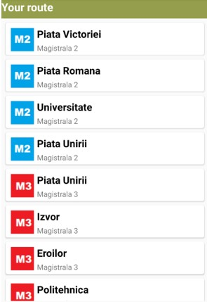

# Subway Route Planning Application
This is a school project meant to find the shortest path from the current location to the desired destination in Bucharest, Romania subway. 

 
## Implementation
 Shortest path is found using Dijkstra's algorithm.
 
## Features
 - Check out your best route 
 - Save routes
 - Give information about the Romanian metro
 - Check real time weather
 - Graph distribution of subway stations on lines
